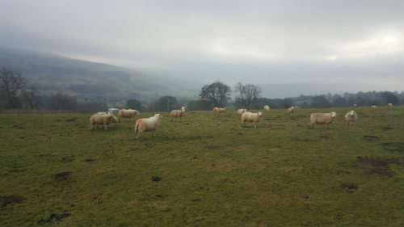
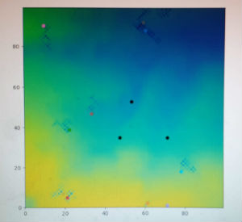

## Sheep Simulator

As part of my Data Analytics Master's course I created a 'Sheep Simulator' using Python. 

[Sheep Simulator Code in GitHub](https://github.com/bdgardner1/Python-Coursework)

In my simulator 10 'sheep' roam around eating grass, depleting the field as they go along. 

There are also three sheep dog (black dots), who move around and 'scare' the sheep back to the centre of the field if they come within a certain distance of them. 

Below is a static picture of my model in action.

