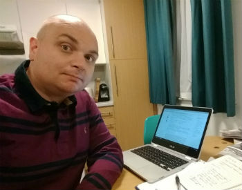
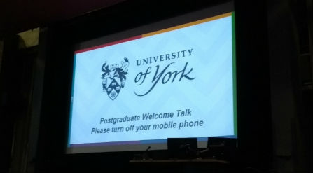

## About Me

My name is Ben Gardner and I'm currently studying for an integrated Masters/PhD at [The University of Sheffield](https://www.sheffield.ac.uk/)

My PhD [project](projects.md) involves working with the Home Office to help improve the efficiency of border/passport control. 

### My Background

I completed a BA in Economics and Politics at the [University of York](https://www.york.ac.uk/) in 2003. 

Between 2004 and 2017 I worked as an HR Analyst for various public and private organisations. 

I decided to return to academia and York in 2017 and completed a Masters in Social Research.

### Python Coursework

[Click here to find out details of my "sheep simluator" created as part of my Python Coursework](SheepSim.md)

### Support or Contact

Having trouble with Pages? Check out our [documentation](https://help.github.com/categories/github-pages-basics/) or [contact support](https://github.com/contact) and we’ll help you sort it out.
